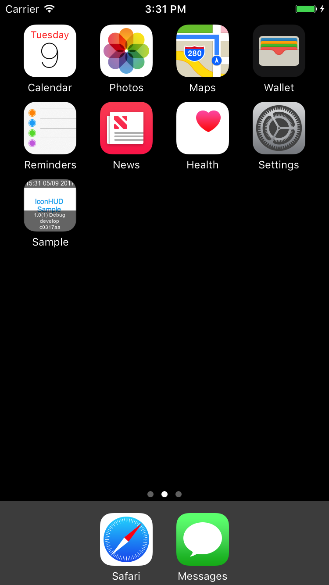

# IconHUD


<p align="center">


</p>

## Features

* IconHUD places information of your app on icon. (version, branch, commit ID, build date, build config etc...)
* It does NOT process icon image file in your project's asset. (IconHUD processes icon image file in build dir only.)
* It does NOT work on release build. (If BuildConfig name is "Release".)

## Installation
```
brew tap tueno/iconhud
brew install iconhud
```

## Usage

Add the line below to RunScript phase of your Xcode project.  
```
iconhud
```

## Notice

* If you don't need to process icon on debug build, use `--ignore-debug-build` option.
* Currently, It doesn't support icon file specified by info.list. (It supports *.xcassets only.)

## TODO

* Show hud even if icon doesn't exist.
* Adjust layout.
